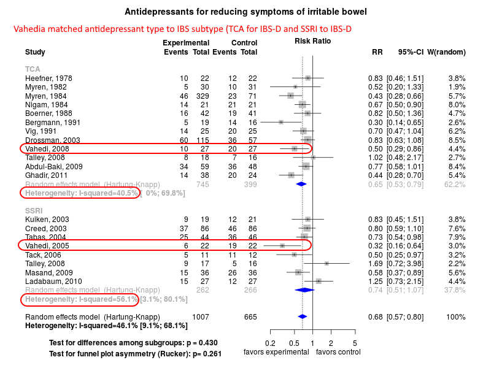

Irritable bowel treatment with antidepressants
============================================
A living systematic review

**Clinical summary:** This meta-analysis suggests that clinical intervention *is* effective if the antidepressant class is matched ot the IBS subtype. Heterogeneity of results as measured by I2 was '[moderate](http://handbook-5-1.cochrane.org/chapter_9/9_5_2_identifying_and_measuring_heterogeneity.htm)' at 46%. This review updates previously published meta-analysis(es).(citation[s] below)

Meta-regression of common modulators (year of publication, study size, event rate in the control groups) finds that the outcome of the intervention is effected by xx.
* [Reconciliation of conclusions with prior meta-analyses](files/reconciliation-tables/Reconciliation%20of%20conclusions.pdf) (under construction)
* [Keep current with this topic](files/searching/Keep-up.md) (under construction)

Acknowledgement: we acknowledge the essential work by the authors of the prior [systematic review(s)](#systematic-reviews) listed below.

**Methods overview:** This repository is an [openMetaAnalysis](https://openmetaanalysis.github.io/) that combines methods of scoping, rapid, and living systematic reviews.  This analysis updates one or more previously published review(s) below. A comparison of studies included in this review compared to prior reviews are in the table, [reconciliation of trials included with prior meta-analyses/](files/reconciliation-tables/Reconciliation%20of%20studies.pdf). Newer studies included are listed in the references below. Rationale for newer trials excluded may be listed at the end of the references. 
* [Methods](http://openmetaanalysis.github.io/methods.html) for openMetaAnalysis
* [Evidence search](files/searching/evidence-search.md) for this review (under construction)

**Results:** Details of the studies included are in the:
* [Reconciliation of trials included with prior meta-analyses/](files/reconciliation-tables/Reconciliation%20of%20studies.pdf) (under construction)
* [Description of studies (PICO table)](files/study-details/table-pico.pdf) (under construction)
* [Risk of bias assessment](files/study-details/table-bias.pdf) (under construction)
* [Forest plots](../master/files/forest-plots) ([source data](files/data))
* [Network plots](../master/files/network) (optional)
* [Reconciliation of conclusions with prior meta-analyses](files/reconciliation-tables/Reconciliation%20of%20conclusions.pdf) (under construction)

The forest plot for the primary outcomes are below. Additional [forest plots](files/forest-plots) of secondary analyses may be available. 

<!--
The meta-regression for the primary outcomes are below. Additional [meta-regressions](files/metaregression) of secondary analyses may be available. 

The GRADE Profile is below. 
-->

References:
----------------------------------

### Systematic review(s)
#### Most recent review at time of last revision of this repository

### Randomized controlled trials
#### New trial(s) *not* included in the most recent review above
1. Abdul-Baki H, El Hajj II, Elzahabi L, Azar C, Aoun E, Skoury A, Chaar H, Sharara AI. A randomized controlled trial of imipramine in patients with irritable bowel  syndrome. World J Gastroenterol. 2009 Aug 7;15(29):3636–3642. PMCID: [PMC2721237](http://pubmed.gov/PMC2721237)
2. Creed F, Fernandes L, Guthrie E, Palmer S, Ratcliffe J, Read N, Rigby C, Thompson D, Tomenson B. The cost-effectiveness of psychotherapy and paroxetine for severe irritable bowel  syndrome. Gastroenterology. United States; 2003 Feb;124(2):303–317. PMID: [12557136](http://pubmed.gov/12557136)
3. Heefner JD, Wilder RM, Wilson ID. Irritable colon and depression. Psychosomatics. England; 1978 Sep;19(9):540–547. PMID: 360266
4. Kuiken SD, Tytgat GNJ, Boeckxstaens GEE. The selective serotonin reuptake inhibitor fluoxetine does not change rectal  sensitivity and symptoms in patients with irritable bowel syndrome: a double blind,  randomized, placebo-controlled study. Clin Gastroenterol Hepatol. United States; 2003 May;1(3):219–228. PMID: [15017494](http://pubmed.gov/15017494)
5. Ladabaum U, Sharabidze A, Levin TR, Zhao WK, Chung E, Bacchetti P, Jin C, Grimes B, Pepin CJ. Citalopram provides little or no benefit in nondepressed patients with irritable  bowel syndrome. Clin Gastroenterol Hepatol. 2010 Jan;8(1):42-48.e1. PMCID: PMC2818161
6. Masand PS, Pae C-U, Krulewicz S, Peindl K, Mannelli P, Varia IM, Patkar AA. A double-blind, randomized, placebo-controlled trial of paroxetine  controlled-release in irritable bowel syndrome. Psychosomatics. England; 2009 Feb;50(1):78–86. PMID: [19213976](http://pubmed.gov/19213976)
7. Myren J, Groth H, Larssen SE, Larsen S. The effect of trimipramine in patients with the irritable bowel syndrome. A  double-blind study. Scand J Gastroenterol. England; 1982 Oct;17(7):871–875. PMID: [6760379](http://pubmed.gov/6760379)
8. Myren J, Løvland B, Larssen SE, Larsen S. A double-blind study of the effect of trimipramine in patients with the irritable  bowel syndrome. Scand J Gastroenterol. England; 1984 Sep;19(6):835–843. PMID: [6151243](http://pubmed.gov/6151243)
9. Nigam P, Kapoor KK, Rastog CK, Kumar A, Gupta AK. Different therapeutic regimens in irritable bowel syndrome. J Assoc Physicians India. India; 1984 Dec;32(12):1041–1044. PMID: [6526796](http://pubmed.gov/6526796)
10. Tabas G, Beaves M, Wang J, Friday P, Mardini H, Arnold G. Paroxetine to treat irritable bowel syndrome not responding to high-fiber diet: a  double-blind, placebo-controlled trial. Am J Gastroenterol. United States; 2004 May;99(5):914–920. PMID: [15128360](http://pubmed.gov/15128360)
11. Tack J, Broekaert D, Fischler B, Van Oudenhove L, Gevers AM, Janssens J. A controlled crossover study of the selective serotonin reuptake inhibitor  citalopram in irritable bowel syndrome. Gut. 2006 Aug;55(8):1095–1103. PMCID: [PMC1856276](http://pubmed.gov/PMC1856276)
12. Talley NJ, Kellow JE, Boyce P, Tennant C, Huskic S, Jones M. Antidepressant therapy (imipramine and citalopram) for irritable bowel syndrome: a  double-blind, randomized, placebo-controlled trial. Dig Dis Sci. United States; 2008 Jan;53(1):108–115. PMID: [17503182](http://pubmed.gov/17503182)
13. Vahedi H, Merat S, Momtahen S, Kazzazi AS, Ghaffari N, Olfati G, Malekzadeh R. Clinical trial: the effect of amitriptyline in patients with diarrhoea-predominant  irritable bowel syndrome. Aliment Pharmacol Ther. England; 2008 Apr;27(8):678–684. PMID: [18248658](http://pubmed.gov/18248658)
14. Vahedi H, Merat S, Rashidioon A, Ghoddoosi A, Malekzadeh R. The effect of fluoxetine in patients with pain and constipation-predominant  irritable bowel syndrome: a double-blind randomized-controlled study. Aliment Pharmacol Ther. England; 2005 Sep 1;22(5):381–385. PMID: [16128675](http://pubmed.gov/16128675)

#### Trial(s) included in the review above

#### Trial(s) undergoing review
None

#### Trial(s) excluded - selected list of important trial(s)

#### Cited by
This repository is cited by:

1. WikiDoc contributors. Pending content page. WikiDoc. Nov 9, 2014. Available at: http://www.wikidoc.org/index.php/This_topic. Accessed November 9, 2014. 

-------------------------------
[Cite and use this content](https://github.com/openMetaAnalysis/openMetaAnalysis.github.io/blob/master/reusing.MD)  - [Edit this page](../../edit/master/README.md) - [License](files/LICENSE.md) - [History](../../commits/master/README.md)  - 
[Issues and comments](../../issues?q=is%3Aboth+is%3Aissue)

